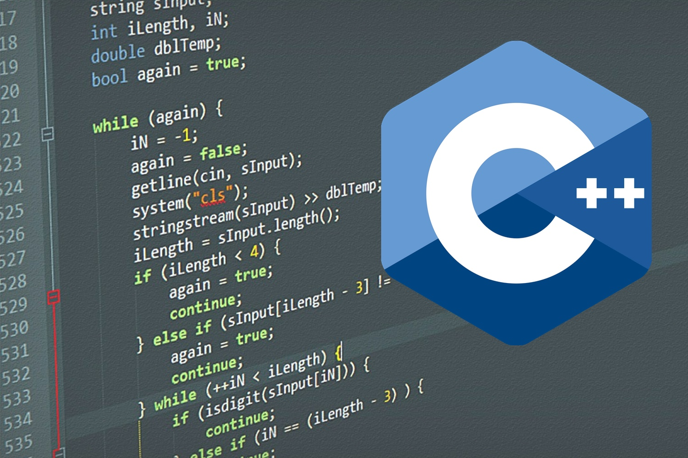

# Proyecto: Detección y reidentificación de caras en secuencias de imágenes o video
## Curso: Estructura de datos

### Integrantes

* Camila Fredes (Programador)
* Rafael Munizaga (Programador)

### Bitácora

[Ver Bitácora](docs/BITACORA.md)

### Resumen

<La empresa ACME desea construir un sistema de vigilancia para contar personas en una zona determinada de un edificio mediante el procesado digital de imágenes o videos obtenidos a través de una cámara. El proyecto requiere entregar información respecto a la cantidad de personas que transitan dicho espacio durante la entrada y salida del edificio, además debe calcular los respectivos flujos de personar en un periodo de una hora para que el guardia pueda acceder a esta información. >

### Documentos

* [Reporte Técnico](docs/README.md)

